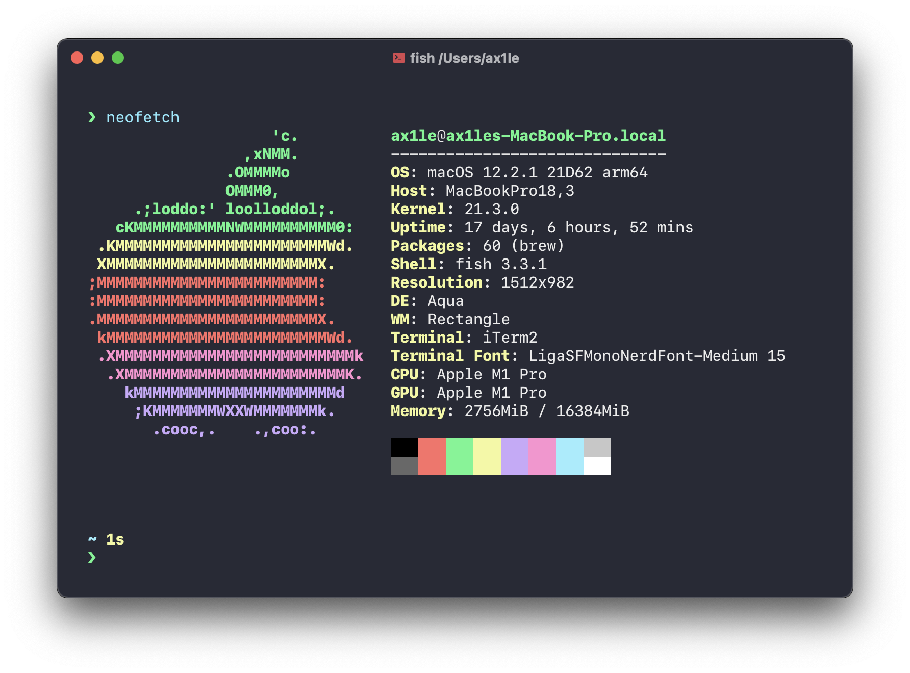
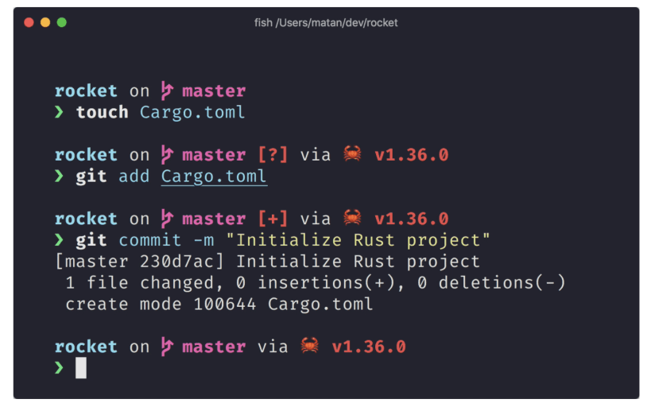
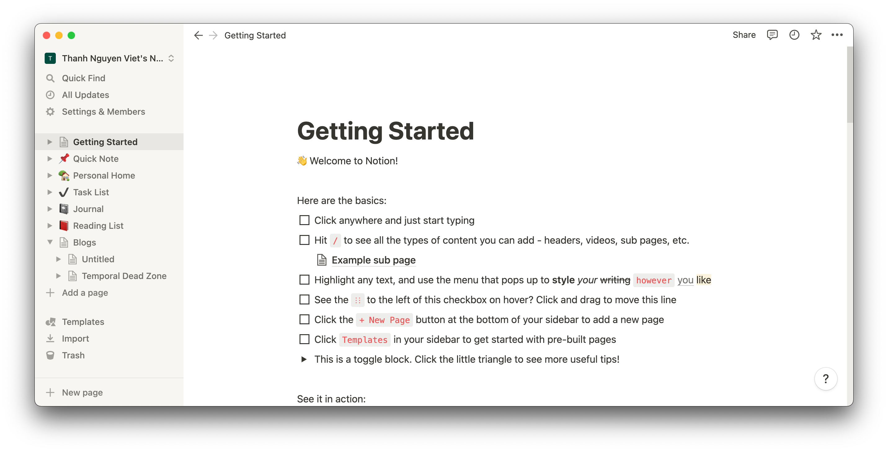
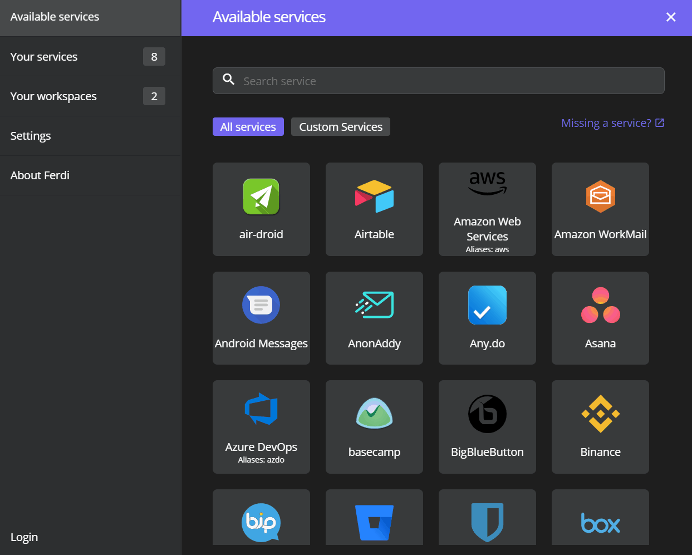

Vì Dev thường là những người lười biếng nên việc sử dụng các tool, công cụ hữu ích sẽ giúp rất nhiều cho công việc. Một khi sử dụng những công cụ không thích hợp có thể làm cho ae dev mất thêm nhiều thời gian.

Vì thế nên mình ở đây để share cho các bạn những tool mình xài mà rất hiệu quả nè =)))

## Dotfiles

https://github.com/shivaluma/dotfiles.fish

Hiện tại mình đang dùng dotfiles của carlos, khá là hợp gu với base shell là Fish.

## Terminal tools

### Homebrew
Debian có apt; redhat có yum, dnf; arch có pacman thì với macOS cũng không thể thiếu một package manager để install các công cụ một cách nhanh chóng được, mặc dù homebrew update và install khá lâu nhưng với repositories app và tool khổng lồ thì sẽ tiết kiệm thời gian rất nhiều vì không cần phải search các install package trên internet.

### Iterm2
Cái terminal default của macOS rất là ...basic. Không có gì đặc biệt nên việc sử dụng một công cụ khác xịn xò, với nhiều tính năng để thay thế nó thì còn gì tuyệt vời hơn. Iterm2 có khả năng break ra nhiều window session như tmux, save các window đó để sử dụng cho lần sau, và với khả năng custom giao diện mạnh mẽ cho các tín đồ của r/unixporn nữa.

### Fish Shell

Tại sao không phải là bash, hay ZSH mà lại là fish. Vì nó quá nhanh và tuyệt vời đó mấy bạn ơi. Support auto complete out of the box nè, syntax highlighting tuyệt vời.

#### Fisher

Để cài plugin cho fish chứ còn làm cái gì nữa.

#### Starship.rs

Dạo này mình rất dễ bị bias các tool viết bằng Rust =)). Chắc chắn sẽ học Rust trong tương lai gần.

Về Starship thì nó là một cái cross-shell promt xài được cho mọi loại shell (giống với powerlevel9k). Với khả năng show environment, git info, command runtime và khả năng customize cực mạnh bằng file config thì nó sẽ giúp ích cho bạn rất nhiều.

#### Fig

Fig thêm các autocomplete giống style của VSCODE vào terminal của bạn. Nghe cool ngầu vl chưa =))

Fig chứa các shortcut có sẵn cho git, .... Bạn cũng có thể tự tạo shortcut cho riêng mình 

Điểm đặc biệt là fig có thể đọc được các lệnh script trong package.json của bạn nữa nhé 

### [fnm](https://github.com/Schniz/fnm)

fnm là một Node version manager cho macOS/Linux.
Từ khi sử dụng fnm mình đã bỏ luôn nvm vì nvm quá lề mề và chậm chạm (cơ mà cũng vì fnm được viết bằng Rust đó :v)

## Desktop Apps

### Visual Studio Code

VSCode là editor phổ biến nhất hiện tại, mặc dù mình cũng có sử dụng qua các editor khác như neovim, sublime nhưng dùng vscode nó vẫn tiện hơn và không tốn quá nhiều thời gian để setup.

#### Plugins

- GitLens: đưa git vào VSCode, xem git blame ngay trên file được edit.
- Import Cost: xem size của imported package, giúp control bundled size bằng cơm.
- Path intellisense.
- Eslint/Pretter.
- React/Javascript snippet.
- vscode-proto3: Support cho protobuf.
- Theme : One Dark Space Gray
- Icon : Material

### Docker Desktop

Chạy docker trên mac, setup nhanh môi trường cho việc lập trình với UI thân thiện, mặc dù hiệu suất không được mượt như trên Linux vì giả lập linux kernel, không biết nếu so sánh với việc chạy parallel linux và map network ra thì như thế nào nhỉ.

### Postgres.app

Tạo server Postgres và quản lý version postgres cho từng server một cách nhanh chóng.

### Tableplus

SQL Client cho macOS với native UI, hỗ trợ nhiều loại database từ SQL cho đến noSQL (cassandra, redis, mongodb)

### Terminus

SSH Client với khả năng quản lý và kết nối đến nhiều server, lưu giữ các credentials an toàn với passphrase.

### Insomnia

API Client như Postman, nhẹ hơn và hỗ trợ cả gRPC.

### Tower

Là một git gui clients được free trong gói Github Student Pack.
Khi gặp nhiều trường hợp khó xử lý bằng commandline thì sử dụng gui client sẽ rất hữu ích.

### Goland

Để code Golang chứ làm gì nữa =)), hàng của Jetbrains Intellij thì có khả năng hỗ trợ intellisense và auto-complete tuyệt vời.

### Karabiner-Elements

Karabiner-Elements (hay gọi tắt là Karabiner) là một ứng dụng phần mềm mã nguồn mở hỗ trợ map key của bàn phím và chuột trên macOS với giao diện người dùng thân thiện và dễ sử dụng.

Mình thường hay map phím Caps_Lock vào Left_control vì phím caps_lock mặc định rất ít khi được sử dụng và ngón tay để với đến left_control khá khó khăn.

Một số tổ hợp mapping complex khác mà mình đang sử dụng.

### Notion

Notion là một ứng dụng ghi chép giúp người dùng có thể dễ dàng lên kế hoạch, ghi chú, lập thời gian biểu,... Tất cả những dữ liệu trên sẽ được lưu trữ vào cùng một không gian để bạn có thể dễ dàng tìm kiếm lại khi cần.

### Ferdi

Thay vì cài messenger, slack, skype, telegram,gmail ... Tất cả các loại clients đó lên chiếc mac của bạn và chạy cùng lúc thì đúng là ác mộng cho cpu/ram và notifications thì đã có Ferdi.

Ferdi là phần mềm chạy trên Windows, MacOS, Linux cho phép người dùng quản lý đăng nhập cùng lúc các tài khoản dịch vụ phổ biến cho công việc hằng ngày.

