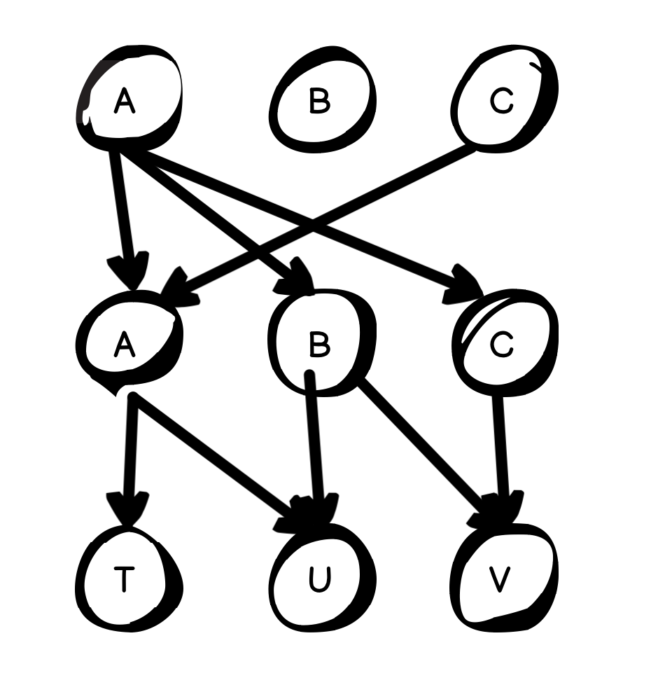

Back in the day of 2000s, 3x4 numeric keypad is an industry standard for every cell phone. 

Some phone like nokia provided a typing mode called T9. T9 let you enter words with a single tap on each number key, instead of selecting each letter with multiple presses. OMG my childhood is back when writing this article @@~

For example, if you want to input the word "cat" with normal input mode. You need to press `222 2 8`.
But with the t9 mode, you only need to type `228`. It looked at all possible pieces of word that a combination of key presses could create, and then it suggested words to the user based on those pieces.

Do you ever ask why your cellphones can give the correct words with that input? 
To give an appropriate prediction, the algorithm needs to consider each possible word that could be created with these letters, like this:

The arrows on the diagram represent choice, 
