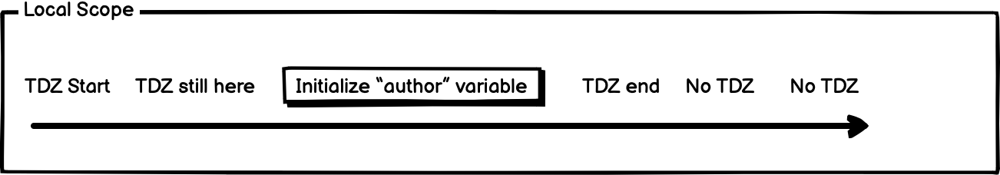

Temporal Dead Zone (TDZ) và Hoisting là hai thuật ngữ thiết yếu khi học sâu về Javascript. Nhưng để hiểu đúng cách hai khái niệm này thì không dễ dàng chút nào, mình từng phỏng vấn một số bạn intern/fresher nhưng có khá ít bạn nắm được và trình bày một cách chính xác.

Nhưng đừng băn khoăn! Bài viết này ở đây để giúp bạn hiểu rõ hơn về hai thuật ngữ trên.

Vì vậy, hãy thư giãn, thưởng thức một tách cà phê yêu thích của bạn và bắt đầu với TDZ =))).

## Vậy TDZ là cái quần què gì

Một cái *Temporal dead zone (TDZ)* là một block ({...}) chứa những biến chưa thể truy cập tới được (inaccessible) cho đến khi cái máy tính nó khởi tạo biến đó với một giá trị được định trước.

Khi bạn sử dụng một biến trước khi biến đó được khởi tạo với let hoặc const, Javascript sẽ trả về một lỗi ReferenceError.

```js 
(function() {
    console.log(y);  // ReferenceError: y is not defined
    let y = 'Hello';
}());
```

Vậy chính xác thì TDZ sẽ bắt đầu và kết thúc lúc nào?

## Scope của Temporal Deadzone

Một block của TDZ bắt đầu ở block của local scope. Và kết thúc khi máy tính đã khởi tạo biến của bạn với một giá trị gì đó.

Ví dụ:

```js 
{
  // TDZ starts here (at the beginning of this block’s local scope)
  // TDZ continues here
  // TDZ continues here
  // TDZ continues here
  console.log(author); // returns ReferenceError because TDZ continues here
  // TDZ continues here
  // TDZ continues here
  let bestFood = "The Fullstacks"; // TDZ ends here
  // TDZ does not exist here
  // TDZ does not exist here
  // TDZ does not exist here
}
```




